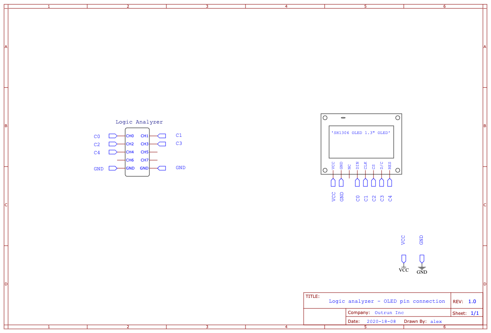
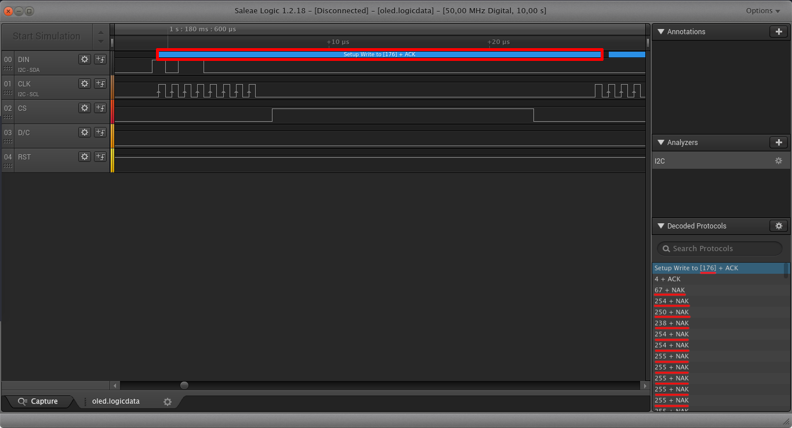
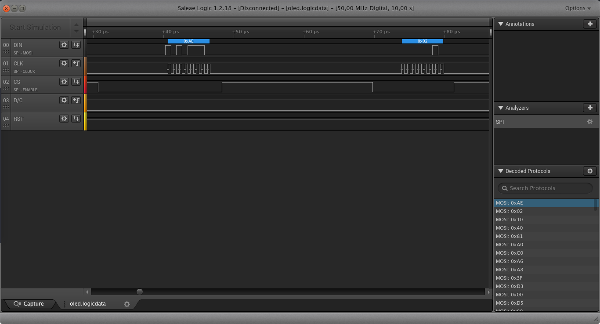
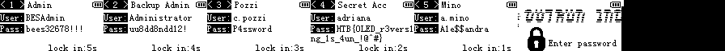

Offline Writeup
===============

RomHack CTF 2020
----------------

### Descrizione

>An APT operative breached our research facility in order to collect credentials from their agent. The network is air-gapped, and communications are jammed, but they managed to save the information to a hardware password manager. The operative escaped, and although we managed to retrieve the device while still unlocked, the OLED screen broke in the pursuit. We managed to capture the serial data sent to the screen before the device locked. Can you retrieve the secret data that will identify the mole?

### Soluzione

Nell'unica challenge hardware della CTF ci sono stati forniti un'immagine contenente lo schema con cui è stato collegato un analizzatore di stati logici ad uno schermo OLED, e un file .logicdata contentente i dati acquisiti dal device. lo scopo della challenge era quello di ricostruire l'immagine visualizzata sullo schermo a partire dai dati contenuti nell'acquisizione.





dall'immagine possiamo notare la sigla dello schermo "SH1306", e che sono stati collegati all'analizzatore solo 5 pin: DIN (Data IN), CLK (clock), RES (reset), CS e D/C.

Dalla descrizione e dalla nomenclatura dei pin è logico supporre che lo schermo riceva i dati sfruttando il protocollo I2C.


Una breve ricerca dell'estensione "logicdata" su internet ci ha portato quindi a scaricare il software della Saleae "Logic 1" per poter visualizzare le tracce dell'acquisizione. Sempre in rete è reperibile un datasheet per un modulo chiamato SSD1306 che è molto simile al SH1306<sup>[1](#footnote1)</sup>.

Il programma, molto intuitivo, ci permette di importare il file e visualizzare su un grafico i vari canali, inoltre possiamo applicare degli analizzatori per decodificare qualche protocollo noto.

Utilizzando l'analizzatore per I2C si notano però dei problemi:


* I frame iniziali non vengono decodificati;
* L'analizzatore non riconosce correttamente la fine del frame;
* Molti frame non ricevono l'acknowledge;
* L'indirizzo utilizzato per selezionare lo slave (176) non corrisponde a quelli specificati nel datasheet (60 o 61).





Tutti questi problemi sono indizi che il protocollo utilizzato non è l'I2C. Leggendo meglio il datasheet si può osservare che lo schermo può utilizzare diverse interfacce: I2C, vari protocolli paralleli, e 3/4 wire SPI.

Aggiungendo quindi un analizzatore SPI, configurato come in figura, possiamo finalmente estrarre i byte inviati allo schermo.





Controllando il valore del pin D/C possiamo poi dividere i byte dei comandi dai dati e capire com'è stato configurato lo schermo.


Byte|Comando|Valore
----|-------|------
0xAE|Set Display ON/OFF|OFF (RESET)
0x02|Set Lower Column Start Address for Page Addressing Mode|2
0x10|Set Higher Column Start Address for Page Addressing Mode|0
0x40|Set Display Start Line|0
0x81<br>0xA0|Set Contrast Control|0
0xC0|Set COM Output Scan Direction|normal mode (RESET)<br>COM0->COM[N-1]
0xA6|Set Normal/Inverse Display|Normal display (RESET)<br>0 in RAM: OFF in display panel<br>1 in RAM: ON in display panel
0xA8<br>0x3F|Set Multiplex Ratio|64MUX (RESET)
0xD3<br>0x00|Set Display Offset|0
0xD5<br>0x80|Set Display Clock Divide Ratio/Oscillator Frequency|Fosc=8<br>D=1
0xD9<br>0x80|Set Pre-charge Period|P<sub>1</sub>=1<br>P<sub>2</sub>=15
0xDA<br>0x12|Set COM Pins Hardware Configuration|Sequential COM pin configuration<br>Disable COM Left/Right remap (RESET)
0xDB<br>0x40|Set V<sub>COMH</sub> Deselect Level| 4->?
0x20<br>0x02|Set Memory Addressing Mode| Page Addressing Mode (RESET)
0xA4|Entire Display On | Output follows RAM content
0xA6|Set Normal/Inverse Display | Normal: 0=off
0xAF|Set Display On/Off | On
|PRIMA IMMAGINE|
0xB0|Set Page Start Address| 0
0x02|Set Lower Column Start Address for Page Addressing Mode|2
0x10|Set Higher Column Start Address for Page Addressing Mode| 0
...|128 byte di dati|...
0xB1|Set Page Start Address| 1
0x02|Set Lower Column Start Address for Page Addressing Mode|2
0x10|Set Higher Column Start Address for Page Addressing Mode| 0
...|128 byte di dati|...
0xB2|Set Page Start Address| 2
0x02|Set Lower Column Start Address for Page Addressing Mode|2
0x10|Set Higher Column Start Address for Page Addressing Mode| 0
...|128 byte di dati|...
0xB3|Set Page Start Address| 3
0x02|Set Lower Column Start Address for Page Addressing Mode|2
0x10|Set Higher Column Start Address for Page Addressing Mode| 0
...|128 byte di dati|...
0xB4|Set Page Start Address| 4
0x02|Set Lower Column Start Address for Page Addressing Mode|2
0x10|Set Higher Column Start Address for Page Addressing Mode| 0
...|128 byte di dati|...
0xB5|Set Page Start Address| 5
0x02|Set Lower Column Start Address for Page Addressing Mode|2
0x10|Set Higher Column Start Address for Page Addressing Mode| 0
...|128 byte di dati|...
0xB6|Set Page Start Address| 6
0x02|Set Lower Column Start Address for Page Addressing Mode|2
0x10|Set Higher Column Start Address for Page Addressing Mode| 0
...|128 byte di dati|...
0xB7|Set Page Start Address| 7
0x02|Set Lower Column Start Address for Page Addressing Mode|2
0x10|Set Higher Column Start Address for Page Addressing Mode| 0
|SECONDA IMMAGINE|
0xB0|Set Page Start Address| 0
0x02|Set Lower Column Start Address for Page Addressing Mode|2
0x10|Set Higher Column Start Address for Page Addressing Mode| 0
...|...|...


Da com'è stato settato possiamo quindi capire che la memoria è stata divisa in 8 pagine, che lo schermo ha una risoluzione di 128\*64 pixel<sup>[1](#footnote1)</sup> ed è diviso in 8 "fasce" orizzontali di 128\*8 pixel ognuna mappata ad una pagina, ogni bit acceso indica un pixel attivo e quindi ogni byte codifica una colonna di pixel nella "fascia".
una volta rimossi i byte di comando, otteniamo 6144 byte di dati che ci permetteranno di ricostruire le 6 immagini mostrate dallo schermo.

```
#!/usr/bin/python

import numpy as np
import scipy.misc as smp
import sqlite3 as lite
from PIL import Image
from bitstring import BitArray
import re

data = np.zeros( (64,128*7,3), dtype=np.uint8 )

f = open("data.bytes", "r")
lines = f.readlines()
img_index = 0
page_index = -1

for b_i, line in enumerate(lines):
    c = BitArray(hex=line)
    bits = re.findall('.',c.bin)
    col_index = b_i % 128
    if (col_index == 0):
        page_index = page_index + 1
    if (page_index == 8):
        page_index = 0
        col_index = 0
        img_index = img_index + 1
    for b_index, b in enumerate(bits):
        if int(b) == 1:
            data[63-((7-page_index)*8+b_index),img_index*128+(col_index)] = [0,0,0]
        else:
            data[63-((7-page_index)*8+b_index),img_index*128+(col_index)] = [255,255,255]
img = Image.fromarray(data, 'RGB')
img.save('flag.png')
```

Utilizzando lo script python riusciamo infine a generare la seguente immagine:



### Flag

HTB{OLED_r3vers1ng_1s_4un_!@^#}

### Note

<a name="footnote1">1</a>: L'unica differenza tra l'SSD1306 e l'SH1306 è la risoluzione di 130\*64 pixel, ma dalla configurazione delle pagine di memoria si può osservare che l'indirizzo iniziale delle pagine è traslato di 2 byte, in questo modo le prime due colonne di pixel non verranno mai utilizzate e quindi la risoluzione effettiva è di 128\*64 pixel
