# Deep Down in the Rabbit Hole

_Hello. Join the search:_

In this challenge we have a pcap file named "The Beginning.pcap". Let's open it with Wireshark.

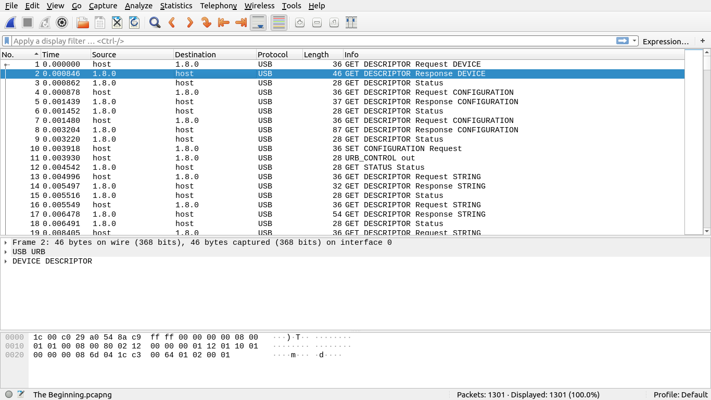

The first thing we see by looking at the 'Protocol' column is that this pcap is a USB packet capture: we have our host communicating with the USB device "1.8.0".
We can try to get some more information about the USB device by inspecting the first packets
and looking for vendor or product name.
The second packet `GET DESCRIPTOR Response DEVICE` looks promising.
In the `DEVICE DESCRIPTOR` field of this packet we have
```
idVendor: Logitech, Inc. (0x046d)
idProduct: Keyboard K120 (0xc31c)
```
So this is a capture of all the packets exchanged between a USB keyboard and a host.
How do we make use of all this?

Before solving this challenge, I had never analyzed a USB pcap on Wireshark, but luckily I've come across [a really well written write-up on Medium about a really similar CTF](https://medium.com/@ali.bawazeeer/kaizen-ctf-2018-reverse-engineer-usb-keystrok-from-pcap-file-2412351679f4). I'd really suggest to give it a read.
I won't enter too much in the details of the USB protocols, but you can find useful resources in the above-mentioned write-up.

What we learn is that everytime the user presses a key, a USB keyboard sends interrupt packets to the host, with the scan-code of the pressed key.

We have to:
1. identify and filter those packets
2. find the scan-code of the key that has been pressed
3. trace back the scancodes to the key

###### 1. Identify and filter interrupt packets

Let's apply a filter to Wireshark to get all and only the interrupt packets that correspond to a key press.

An interrupt-type packet is identified by the value `0x01` in the transfer_type field.
Besides, a key press will always generate a non-zero scan-code
Therefore, our filter will be:

`(usb.transfer_type == 0x01) &&  !(usb.capdata == 00:00:00:00:00:00:00:00)`

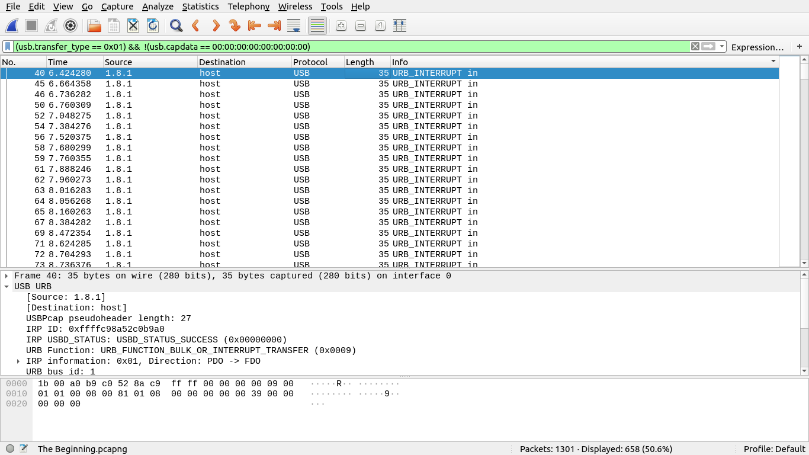

We could export these packets now and use some script to extract the scan-code from every packet, but let's try to make us things easier:
we click on a packet, scroll all the way down in the 'Packet details' window and right-click on `Leftover Capture Data`. From the context menu we click on *Apply as column*.

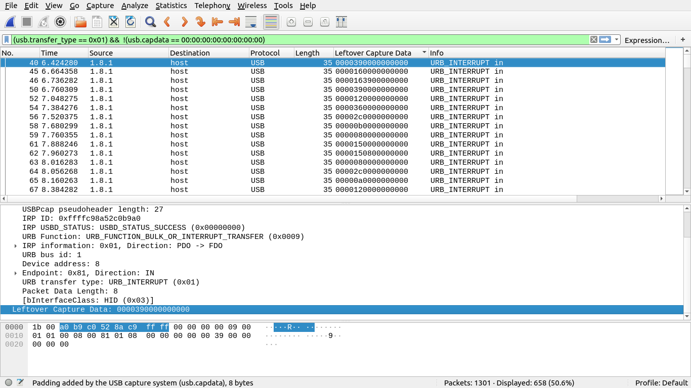

Muuuch better.

###### 2. Find the scan-codes

Now we can just export the columns as CSV (File -> Export packet dissections -> As CSV...) and extract the scan-codes with a bash oneliner:

`cat usb_pcap.csv | cut -d "," -f 7 | cut -d "\"" -f 2 | grep -vE "Leftover Capture Data" > scancodes.txt`

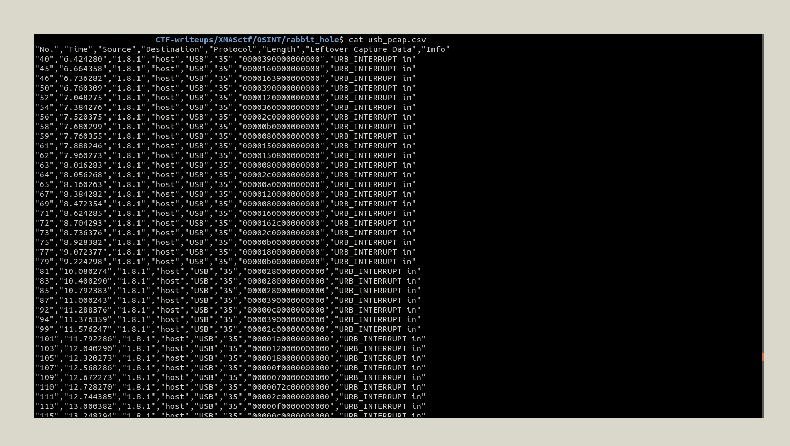

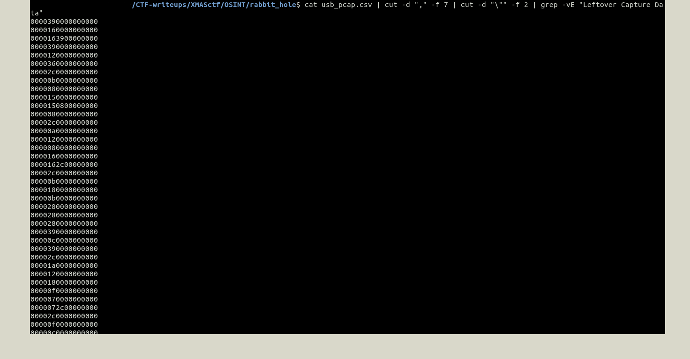

###### 3. Map scan-codes to keys

With a quick Google search we find out the mappings we need, then we can write a simple python script to "translate" the message. I used the python script from the aforementioned Medium write up, after tweaking it a little bit (I added some punctuation, mapped the 'Caps Lock' key to '^' for better readability and removed some useless scan codes) (you can find the script in the main folder of this repo).

The output is the following:

```
^ss^^o, herree goess  huh


^i^ wouldd  like to show you a world of grreeeaat wonder.

^tt^^haatt is, the ^i^nterneett.

^i^ will show you fivvee daemons, eeaach will ttaake you to a different period of time.

^n^ow, your first daemon is ^dd^^am__del__emon ^i^/__del__,

^tt^^o get therree, you will try__del____del____del__access aa  mon__del__dern website...__del____del____del__ thaatt is rreeddit __del__.com__LeftArrow____RightArrow__

^yy^^ou  wwill get on a subb__del__reddit /r/__LeftArrow____RightArrow__

which is ccaalleedd by the mdd55 haassh 9^lowercaasse0^ of ^e^x ^l^int,

thaatt is __del__, the md5 haassh of '^e^x ^l^int'

^aa^^nd rreemember, .....__del____del____del____del____del__21charactersandnomore


^t^he haassh staarrts with 8fd5.

^gg^^oodd  luck, wwaandereerr.

p////
^t^rab///


^trraansmission endeedd^.
```

Looks pretty good. Now we just have to make some cleaning.
* Every letter preceded and followed by a '^' has to be uppercase.
* Every symbol followed by a '\_\_del\_\_' has to be deleted.
* '\_\_LeftArrow\_\_' and '\_\_RightArrow\_\_' were used to move the cursor along the text while typing, but since they always come together, we can simply ignore them.
* At some point we see `9^` and `0^`. Those are probably presses of the '9' and '0' keys while holding shift. If we take a look at a picture of a Logitech K120 keyboard, we see that the '9' and '0' keys also correspond respectively to '(' and ')'.
* There are many letters who seem to appear twice. My explanation is the following (feel free to correct me in the comments if this is wrong or not 100% accurate): the USB keyboard sends an interrupt every time a key is pressed, and keeps sending them as long as the key is held down. The text editor, however does not necessarily recognize these two interrupts as two different presses if the time interval between them is short enough. The host DOES detect two interrupt (and that's why we see them in the pcap), it's the text editing software that needs a longer time interval to recognize the key press as a key being held down.

The clean version of the text is the following:

```
So, here goes  huh

I would like to show you a world of great wonder.

That is, the Internet.

I will show you five daemons, each will take you to a different period of time.

Now, your first daemon is Daemon I,

to get there, you will access a modern website that is reddit.com

You will get on a subreddit /r/ which is called by the md5 hash (lowercase) of Ex Lint, that is, the md5 hash of 'Ex Lint'

And remember, 21charactersandnomore

The hash starts with 8fd5.
Good luck, wanderer.
```

Nice and clean, good.

We run  `echo -n "Ex Lint" | md5sum | cut -c 1-21` (mind the `-n` option in the `echo` command: without `-n` it would add a trailing newline and the hash we need would be completely different) and we get our subreddit:

https://www.reddit.com/r/8fd541a4349f57520e788/

## Daemon I

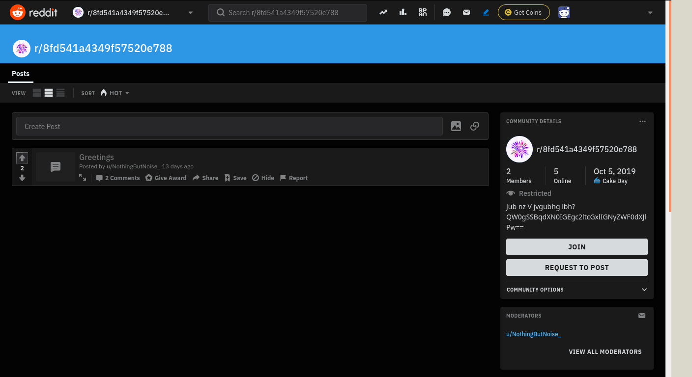

This is the only post in the subreddit:

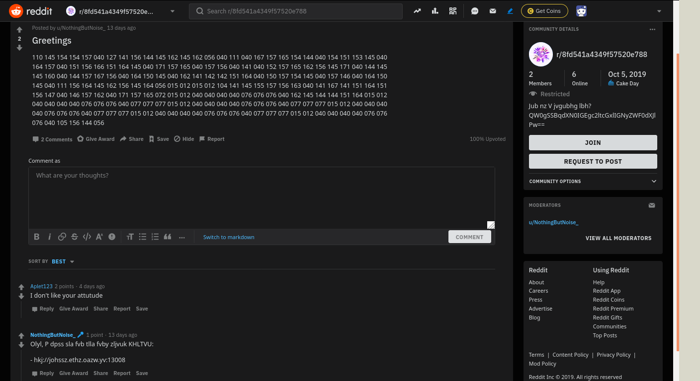

Those numbers are clearly something encoded in base 8. The comment below is probably some text encrypted with a simple cipher like the Caesar Cipher; same thing for the first line on the sidebar on the right. The second line is evidently something encoded in base64, since there are some `=` at the end of the string, which are padding characters in base64.

Caesar cipher can cracked super quickly using any online tool, same thing for octal and base64.

The plaintext page looks like this (there's no need to replace ciphertext with plaintext in the web page, I did it for clarity and to give an overall look of the whole page):

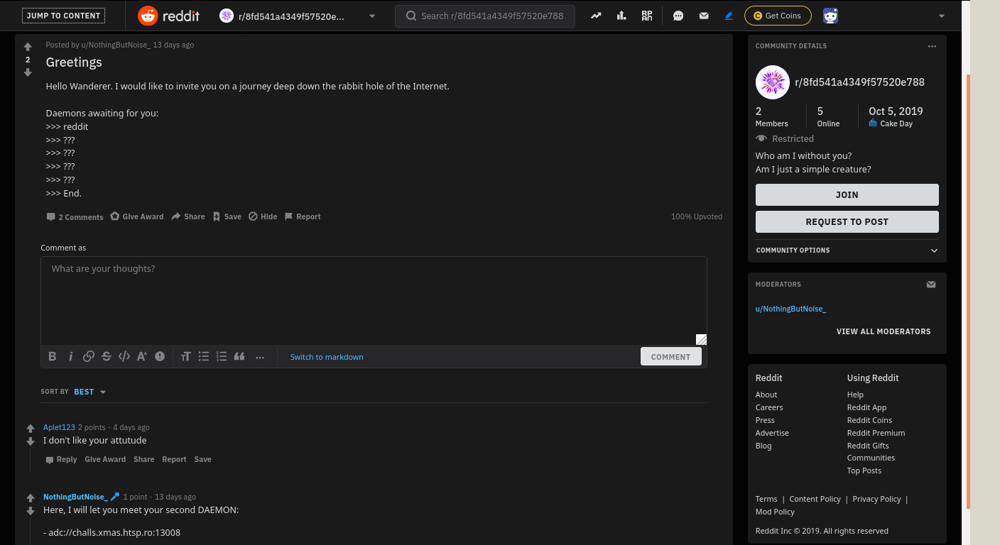


The two lines on the side bar "Who am I without you? Am I just a simple creature?" are lyrics from the song _Particles_ by **Xilent**. This is not really a useful detail, but you'll see later why I pointed this out.

Now we know that there are four more steps (or Daemons) to solve.

## Daemon II

Let's see what we can do with the address given in the comment. I did some research about the adc protocol (Advanced Direct Connect) and downloaded a client to connect to that address.

I used EiskaltDC++, but one of the admin of the CTF assured me that any client would have been appropriate.

I launched the client, set a username, and connected to the hub.
I was greeted with the following welcome message:

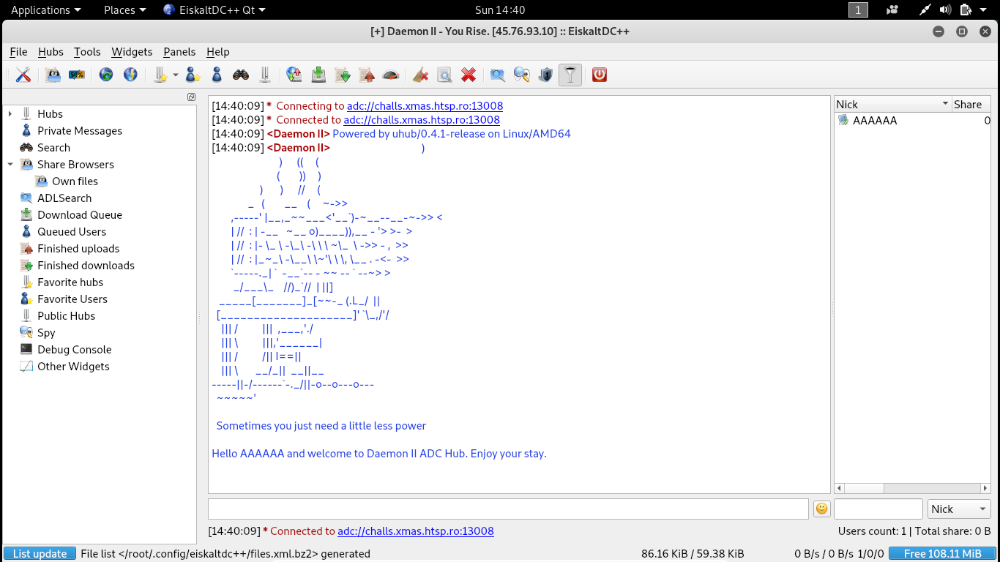


The ASCII art is actually a little deformed as this client messed up the spaces. It should look something like this:

```
                                      )
                            )      ((     (
                           (        ))     )
                    )       )      //     (
               _   (        __    (     ~->>
        ,-----' |__,_~~___<'__`)-~__--__-~->> <
        | //  : | -__   ~__ o)____)),__ - '> >-  >
        | //  : |- \_ \ -\_\ -\ \ \ ~\_  \ ->> - ,  >>
        | //  : |_~_\ -\__\ \~'\ \ \, \__ . -<-  >>
        `-----._| `  -__`-- - ~~ -- ` --~> >
         _/___\_    //)_`//  | ||]
   _____[_______]_[~~-_ (.L_/  ||
  [____________________]' `\_,/'/
    ||| /          |||  ,___,'./
    ||| \          |||,'______|
    ||| /          /|| I==||
    ||| \       __/_||  __||__
-----||-/------`-._/||-o--o---o---
  ~~~~~'

  Sometimes you just need a little less power

Hello AAAAAA and welcome to Daemon II ADC Hub. Enjoy your stay.
```

The name of the hub was "You Rise". Once again, this was nothing useful for this daemon, but you'll see later.

Now.
We were stuck on this for literally **TWO WHOLE DAYS**. We tried intercepting traffic with wireshark and a lot of other things that lead us to nothing.

Then, finally, my teammate [Jacopo](https://github.com/darumaseye), who I was working with on this challenge, had the genius idea to check out the [uhub documentation](https://www.uhub.org/doc/), since uhub was the client being used to host the hub, as you can read in the first welcome message.

He read about ['mod_welcome' plugin](https://www.uhub.org/doc/plugins/info.php?name=mod_welcome), which "Provides a simple message of the day and rules functionality."

>  This plug-in provides mechanism for specifying a Message Of The Day (motd) when users are connecting, and also hub rules.

> This information is sent automatically when users connect, or users can request this information using the !motd and !rules commands.

So he tried sending the `!rules` command in chat and the hub replied with:
```
<Daemon II> Rules:
1. Play by the book.
2. Break the book.
3. Be free.
4. Listen to https://www.youtube.com/watch?v=TKfS5zVfGBc
5. Follow the breadcrumbs of Daemon III: http://challs.xmas.htsp.ro:13010/fdfuc09nac09qcoifscacs/b/
6. You might want to use these two: http://aachan.sageru.org and eda3a74b055814dc6e921cdec6c32f6f
```

We were finally able to progress to the next step.

## Daemon III

We took a quick look at the Youtube video. It was from 2009 so there was no way it could have been uploaded specifically for the challenge. We tried to skim through the comments, up to the ones dating back to some days before the beginning of the CTF. Nothing came up, so we concluded that the Youtube video was useless for this Daemon.

The first site was clearly some sort of 4chan board. We examined every page but noticed that every post dated back to two days after the beginning of the CTF, at most.
We also looked for open directories exploring the paths of uploaded images, but we didn't find anything.

We took a look at the second site and at that hex string that looked like an md5 digest.

While exploring the second site, we found an "Upload" section, which can be accessed from the "Upload" link at the top of the sidebar on the left.
We typed some text, selected on of the checkboxes and clicked on "Submit".

We got the following link

`http://aachan.sageru.org/browse.pl?md5=` + some md5digest.

Replacing the digest in the url with the one provided by Daemon II, we obtained the following ASCII art:

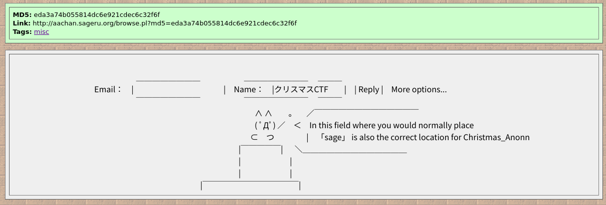

It was pretty clear that we had to create a post with specific values in the fields.

We googled "sage" and on UrbanDictionary we found out this:

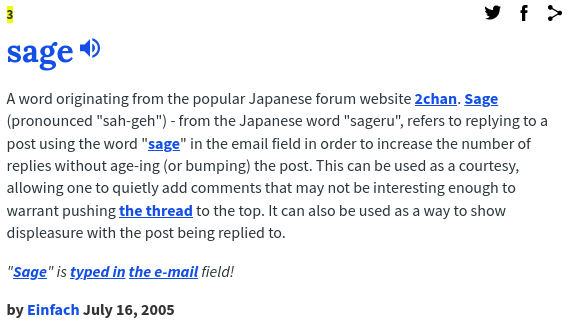

Also, Google translate told us that "クリスマス" means "Christmas" in japanese, therefore the "クリスマスCTF" in the name field of the ASCII art meant simply "Christmas CTF".

The email field had to be "sage".

We tried so many times to submit posts using "クリスマスCTF" as name and "sage" as email, or slight variations of that, but to no avail.

It took us more time that I care to admit to notice that the bunny/cat/whatever_the_f_is_that_thing_in_the_ascii_art was pointing at the name field (or, at least, that's what we thought he was doing). 

We tried to publish a post using "Christmas_Anonn" as name, "sage" as email and it redirected us to the next daemon.


## Daemon IV

https://xmas-party.neocities.org/

This was actually the easiest step for us. From the URLs of the gif we tried to see if there were some open directories on the page. And, in fact, there were.
All the gifs were in the "uploads" directory, which was accessible.
Here, we found two .txt files, `daemon555.txt` and `daemon555creds.txt`.

I read through the whole `daemon555.txt` and just at the bottom it said:

> CHECK OUT THIS AWESOME WAREZ SERVER: ftp://challs.xmas.htsp.ro:13011

Nice. Another step done. In the `daemon555creds.txt` file we had some credentials.

We connected to the ftp server, logged in with the creds, and downloaded the files.

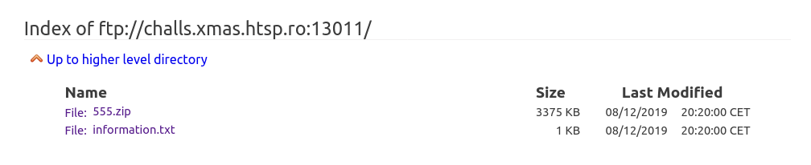

## Daemon V

This was the content of the `information.txt` file:

```
Welcome, wanderer.
You have arrived at the last daemon. There is one more challenge awaiting you.

Decode the message in 555.zip, and be enlightened.
Itllphkw bl pxtkxwnlm
```

I know what you're thinking about that last line.
Caesar chipher?
Yup, Caesar chipher.

The plaintext is: `Password is wearedust`.

I googled for "we are dust" out of curiosity, and found out that it's the titled of the last album by Xilent. Yes, the same Xilent we had found when looking for those two encoded strings in Daemon I.

We unzipped the password-protected archive, and we got two files:
* An mp3 file named `555.mp3`
* A png image named `555.png`

The png was the waveform of an audio track with some highlighted sections.

I opened the mp3 files with Audacity and the first thing I tried was to look at the spectrogram of the highlighted section, hoping that the flag had been written in it. Nnnope.

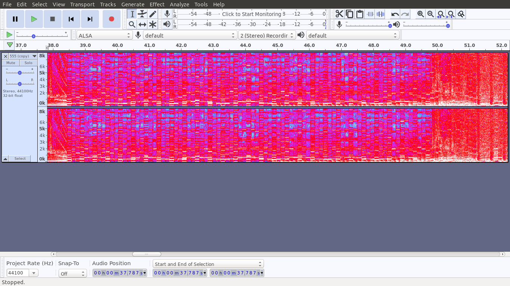

I switched back to the waveform and started listening to the song, that I've found out to be the last track from Xilent abovementioned album.

While listening to the song I paid specific attention during the section highlighted in the png. I noticed some irregular patterns of two alternating notes. They were in perfect timing with song but musically they didn't make much sense.

I started to transcribe every one of those notes either as a 0 or a 1, depending on their pitch: 0 for the lower one, 1 for the higher.

After translating from binary to ASCII, I got the following string:

**X-MAS{S3t3c_Astrpn0my|**

It was clear that this was the flag, I only had got some bits wrong.
The last symbol "|" corresponds to "1111100" in ASCII encoding. Since the very last bit of the flag in the song was super distorted, I wasn't actually sure if that was a 0 or a 1. I mean, I was sure it had to be a `}` but I took a look at an ASCII table and verified that in fact `|` and `}` only differ by the last bit.

Same thing for that `p`. It was actually a `0`.

We finally had our flag:

## X-MAS{S3t3c_Astr0n0my}