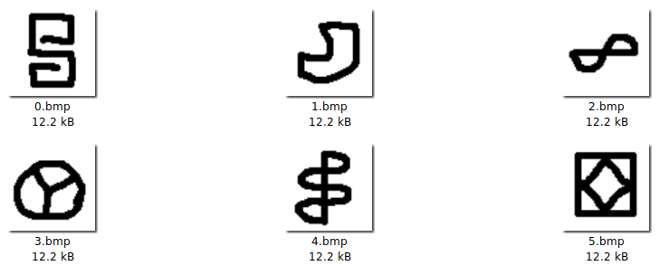
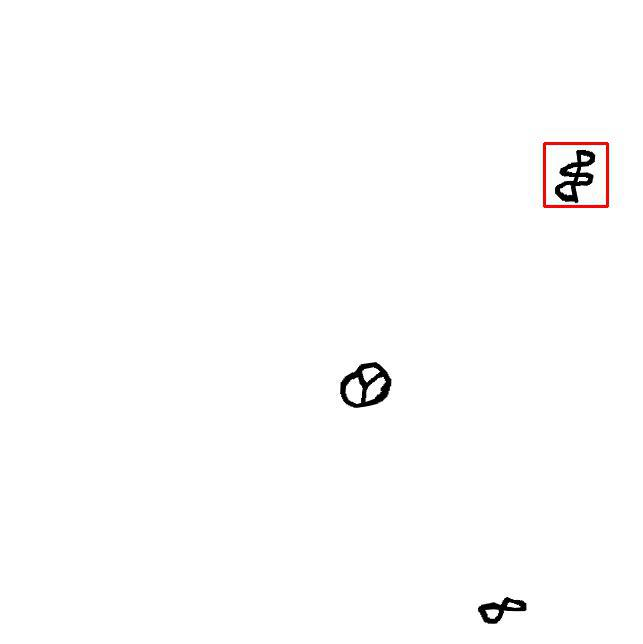
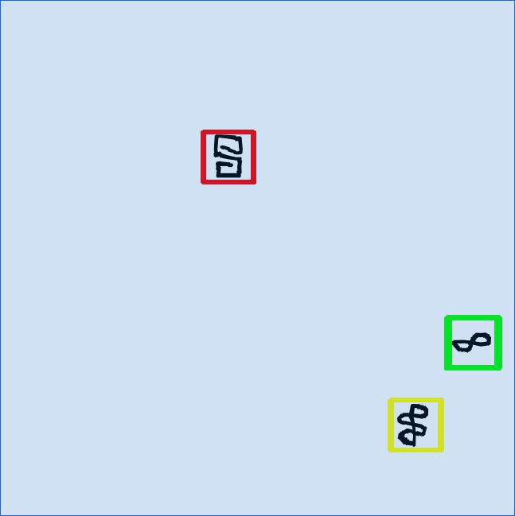
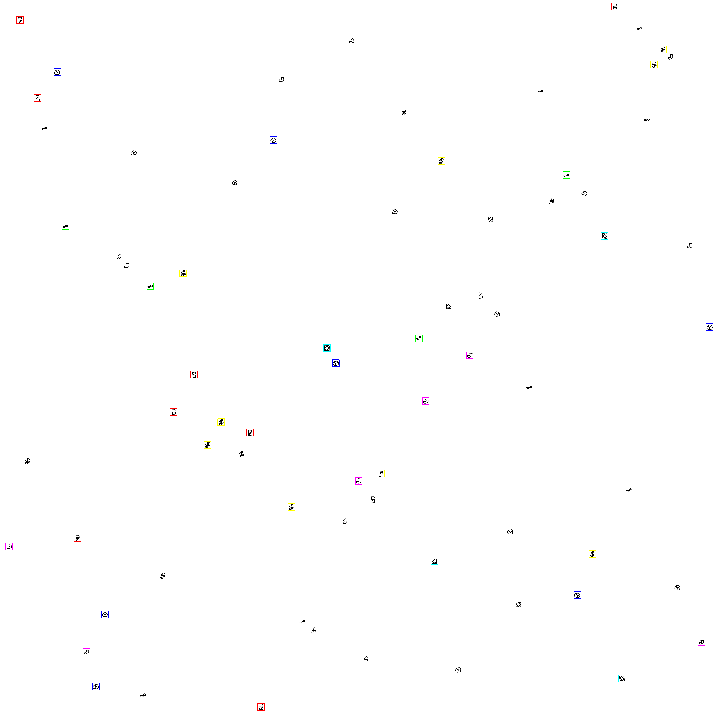

# Ancient Christmas

### Description

As he was walking through the stables, Rudolf found a weird antique wall on
which a lot of weird symbols we're written. Help him count the symbols to see
what's behind this wall.

The number of symbols should be written in the same order as here:
download

Remote server: `nc challs.xmas.htsp.ro 14001`

Author: Gabies


## First round

When we connected with `netcat` to the challenge the server presents us this
message:

`Provide a hex string X such that sha256(X)[-6:] = def3ac`

This is a simple CAPTCHA. We need to find an hex string that has the last six
letters corresponding to the code.

To solve this we generated a small dict with `crunch`:

    crunch 1 5 "ABCDEFGHIJKLMNOPQRSTUVWXYZabcdefghijklmnopqrstuvwxyz0123456789" -o dict

and then we used a simple `bash` function to create all the `sha256` of the dict:

```
hashlines() {                                                                                              
  python -c '
import sys, hashlib
for line in sys.stdin:
    print(line.rstrip("\n") + ":" + hashlib.sha256(line.rstrip("\n")).hexdigest())'
}
```

After that we generated our dict of `sha256`:

      hashlines < dict >> dict.sha256

At his point with a simple `grep hash$ -m 1 dict.sha256` we can find the right
string.

N.B. When we solved this challenged we already know that this is a simple
CAPTCHA because another challenge on the X-MAS CTF starts in the same way.

## The real challenge

After the first step the challenge send us a `base64` encoded image, asking us
to count the symbols that are present in it. We have to compose a simple list
that respects the order of the [given symbols](https://drive.google.com/drive/u/1/folders/1MTTRQ0PN1W1r8-MV_1zl5kf6F4uuHCJc?usp=sharing)



So, if we see 3 occurrences of `1.bmp` and 2 occurrences of `4.bmp` we have to
answer `3,0,0,2,0,0`.

At first we simply tried to answer interactively to the question, automatizing
the image visualization process: the image get bigger on each level and after
the first 2 levels it took some time to count all the symbols and the
challenge replied us `"Response took too long. Try moving faster!"`.

Doh! No way to make it manually.

We started researching about image similarity and template matching and we find
out the [Template Matching](https://docs.opencv.org/master/d4/dc6/tutorial_py_template_matching.html)
function of OpenCV.

It is a method for searching and finding the location of a template image in a
larger image.

We made some tests and obtained some promising results:





We noticed that the symbols on images were slightly distorted and to improve our
results we generated some distorted templates using `Augmentor`.

We finally get some decent result but we have another little (big) problem:
__TIME__.

We discovered that we have only 20 seconds to submit the solution for each
level.

So we made the code more efficient:

- Avoid to write files to disk and just take it in memory. Write to disk can be really slow.
- Parallelized our template matching process. In this way we could analyze 8
templates at the same time.
- Used the maximum buffer we can for socket to avoid buffering bottlenecks (at
first we used `pwntools` and it wasn't really efficient to handle big images)
- Analyzed black and white images (this one did the trick!). At first we didn't
figured out that we're dealing with RGB images (even if the seemed b/w).
Converting it to b/w before the analysis has speeded up our code to what we needed.

Here is our last winning test!



Here is out performance results:
`Time for last reply` refers to the time that took the images to be generated
on server and received by us.
`Time for image analysis` refers to the actual time used to make the template
matching.

```
Level #1
Time for image analysis: 0.2246081829071045

Level #2
Time from last reply: 0.49991321563720703
Time for image analysis: 0.7288467884063721

Level #3
Time from last reply: 1.0785977840423584
Time for image analysis: 1.3566787242889404

Level #4
Time from last reply: 2.0607364177703857
Time for image analysis: 2.3071489334106445

Level #5
Time from last reply: 3.5537657737731934
Time for image analysis: 3.4568943977355957

Level #6
Time from last reply: 5.049955606460571
Time for image analysis: 5.214289665222168

Level #7
Time from last reply: 7.283015966415405
Time for image analysis: 7.399467945098877

Level #8
Time from last reply: 9.022373676300049
Time for image analysis: 9.546133756637573

Level #9
Time from last reply: 12.142165660858154
Time for image analysis: 11.653703451156616

Level #10
Time from last reply: 20.740880966186523
Time for image analysis: 14.45781946182251

Level #11
Well done!
Congratulations, you are now a symbol recognition master!
Here's your flag: X-MAS{D0_y0u_1ik3_my_h0l35?}

Total time execution: 119.20554208755493
```

This is not the fastest result, but fast enough :)
The code is also not always accurate: sometimes a symbol gets identified by 2
different templates: probably handling this situation can improve the accuracy.
